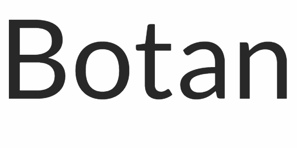
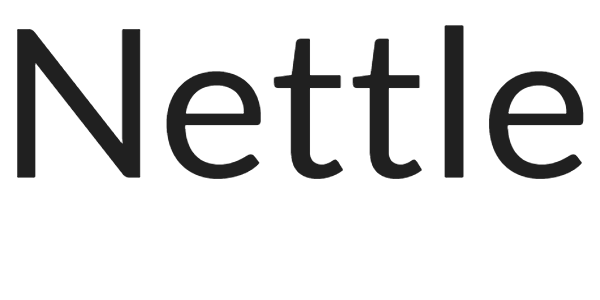

# CNS

This repo contains my homeworks for Computer and Network Security course by professor F. D'Amore

## List of homeworks

### [The impact of shift registers on CFB mode of operation](Homework-1)

**Date:** 12/10/2018

### [Find a collision on a weakened SHA-1](Homework-2)

**Date:** 11/11/2018

### [Collection of open-source cryptographic libraries](Homework-3)

**Date:** 13/11/2018

### [Diffie Hellman for 3 or more parties](Homework-4)

**Date:** 23/10/2018

### [Public and private key storage: file formats and encodings](Homework-5)

**Date:** 30/11/2018

### [Secure protocol to play Roshambo](Homework-6)

**Date:** 7/12/2018