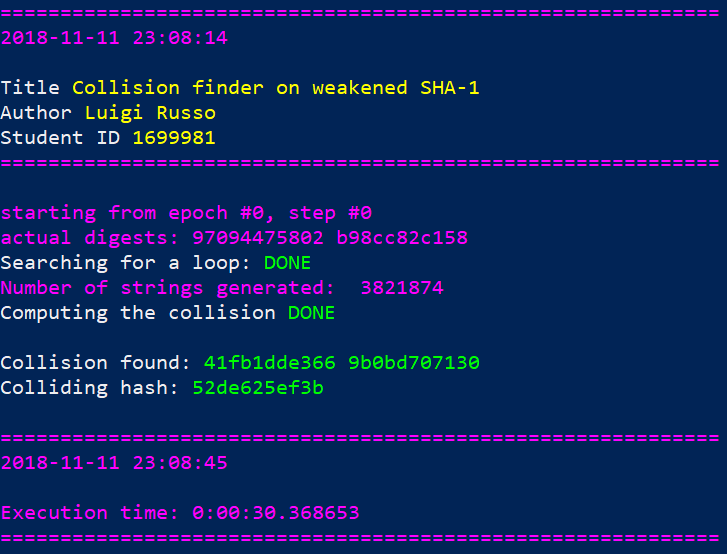
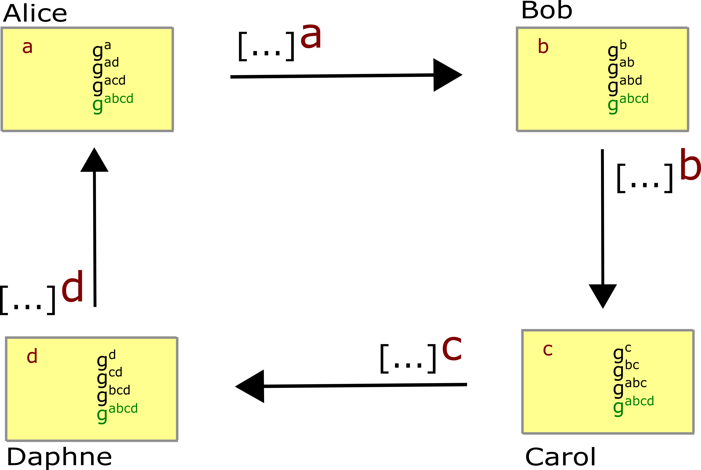
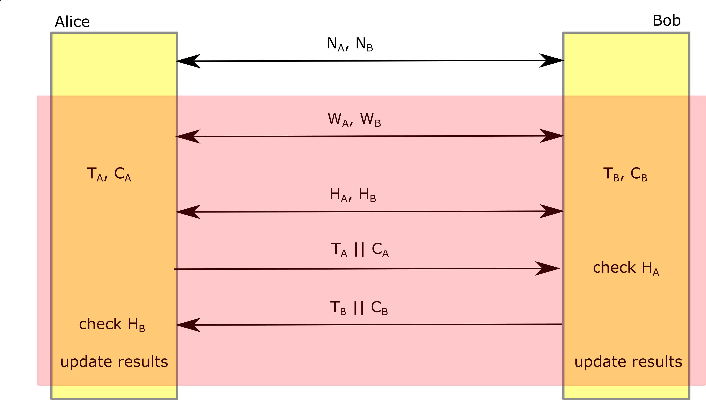

# Computer Network Security 
This repo contains my homeworks for Computer and Network Security course by professor F. D'Amore.

## Homework #1
**Date:** 12/10/2018

**Title: [The impact of shift registers on CFB mode of operation](Homework-1)**

## Homework #2
**Date:** 11/11/2018

**Title: [Find a collision on a weakened SHA-1](Homework-2)**

## Homework #3
**Date:** 13/11/2018

**Title: [Collection of open-source cryptographic libraries](Homework-3)**

## Homework #4
**Date:** 23/10/2018

**Title: [Diffie Hellman for 3 or more parties](Homework-4)**

## Homework #5
**Date:** 30/11/2018

**Title: [Public and private key storage: file formats and encodings](Homework-5)**

## Homework #6
**Date:** 7/12/2018

**Title: [Secure protocol to play Roshambo](Homework-6)**

